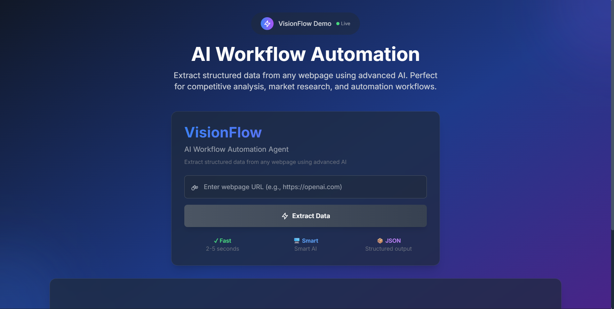

# VisionFlow

AI-powered data extraction and workflow automation platform.



## 🌐 Live Demo

- **Frontend**: [https://visionflow1.netlify.app/](https://visionflow1.netlify.app/)
- **Backend API**: [https://visionflow-he8n.onrender.com/](https://visionflow-he8n.onrender.com/)

## Features

- ✨ Extract structured data from any webpage
- 🚀 Fast processing with modern AI
- 📊 Clean dashboard interface
- 💾 SQLite data persistence
- 🔄 Real-time updates

## Quick Start

### Prerequisites

- Python 3.10+
- Node.js 18+
- Google AI API key

### Installation

1. **Clone repository**
```bash
git clone <repository-url>
cd VisionFlow
```

2. **Backend setup**
```bash
pip install -r requirements.txt
```

3. **Frontend setup**
```bash
cd frontend
npm install
```

### Configuration

1. Create `backend/.env` file:
```
GOOGLE_AI_API_KEY=your_google_ai_api_key_here
FLASK_ENV=development
FLASK_DEBUG=True
```

2. Get Google AI API key from [Google AI Studio](https://aistudio.google.com/app/apikey)

### Running

**Start backend:**
```bash
cd backend
python app.py
```

**Start frontend:**
```bash
cd frontend
npm start
```

Visit `http://localhost:3000`

## Deployment

### Render (Recommended)

Deploy the backend to Render for free hosting:

1. **Connect Repository**
   - Link your GitHub repository to Render
   - Select the VisionFlow repository

2. **Create Web Service**
   - Build Command: `pip install -r requirements.txt`
   - Start Command: `gunicorn -w 4 -b 0.0.0.0:$PORT wsgi:app`

3. **Set Environment Variables**
   ```
   GOOGLE_AI_API_KEY=your_google_ai_api_key_here
   FLASK_ENV=production
   ```

4. **Auto-Deploy**
   - Render deploys automatically on git push
   - Get your API URL from Render dashboard

### Netlify (Frontend)

Deploy the frontend to Netlify for free hosting:

1. **Connect Repository**
   - Link your GitHub repository to Netlify
   - Set base directory to `frontend`

2. **Build Configuration**
   - Build Command: `npm run build`
   - Publish Directory: `build`

3. **Set Environment Variables**
   ```
   REACT_APP_API_URL=https://visionflow-he8n.onrender.com
   ```

4. **Deploy**
   - Netlify builds and deploys automatically
   - Custom domain support available

See [DEPLOYMENT.md](docs/DEPLOYMENT.md) for Render details and [NETLIFY_DEPLOYMENT.md](docs/NETLIFY_DEPLOYMENT.md) for Netlify details.

## Project Structure

```
VisionFlow/
├── app.py           # Main Flask application
├── extract.py       # Data extraction logic
├── database.py      # Database operations
├── wsgi.py         # WSGI entry point
├── requirements.txt # Python dependencies
├── frontend/         # React application
│   ├── src/
│   │   ├── App.jsx
│   │   ├── components/
│   │   └── index.css
│   ├── package.json
│   └── netlify.toml # Netlify deployment config
├── docs/            # Documentation
├── render.yaml      # Render deployment config
└── README.md
```

## API Endpoints

- `GET /` - Health check
- `POST /extract` - Extract data from URL
- `GET /data` - Retrieve extractions
- `GET /extractions/<id>` - Get specific extraction

## Development

Built with Flask and React, using Google Gemini AI for extraction.

## License

MIT License
